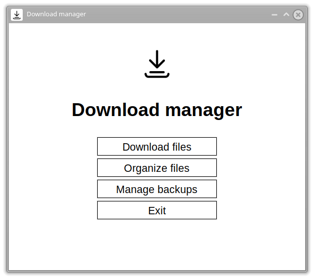
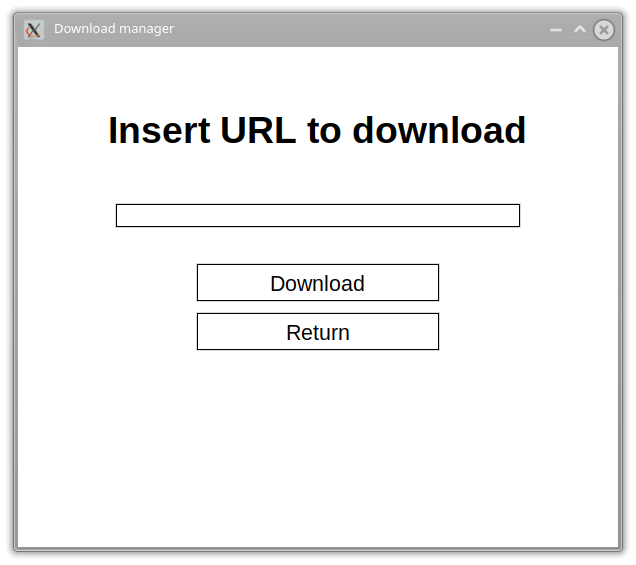
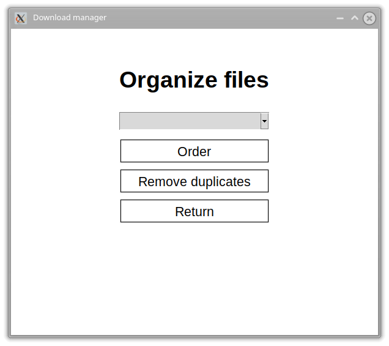
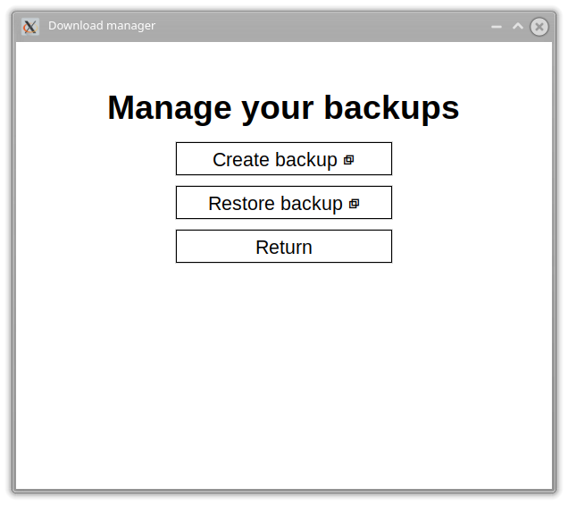

<image src="./docs/images/icon.png" height="150" />

<h1 align="center">Python Downloads Manager</h1>

**Python Downloads Manager** is a program that manages downloads from links, handles backups, and organizes files in a download folder.

## Features

- Downloading files from url
- Managing backups
- Organizing files
- Delete duplicates

## Screenshots

## License

Licensed under the [GPLv3](https://www.gnu.org/licenses/gpl-3.0.en.html) license.